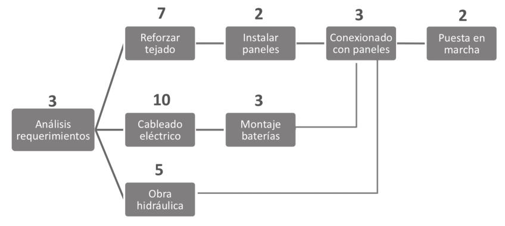

<!-- .slide: class="intro" -->
# M05.UF1.NF1.A1
# Gestió de Projectes
### CFGS DAW-BIO
<small>Pedro Durán / <pduran5@xtec.cat></small>

---

# Gestió de projectes

- Després de realitzar l'anàlisi de viabilitat d'un projecte i el disseny del mateix, la següent fase consistirà a dur a terme
la seva **planificació**.

---

# Planificació temporal del projecte

- Els passos necessaris per realitzar la **planificació temporal del projecte** són:
    * definició d'activitats.
    * seqüenciament d'activitats.
    * estimació de la durada de les activitats.
    * desenvolupament del cronograma o pla de projecte.
    * control de la planificació.

--

# Definició d'activitats

- Una vegada s'han ajustat, detallat i redefinit totes les **activitats del projecte**, s'estarà en disposició d'analitzar
les **prioritats d'execució** d'unes sobre unes altres, les seves **dependències** o la seva **durada**, entre altres aspectes, amb
l'objectiu de definir el pla de projecte.

--

# Seqüenciament d'activitats

- Consistirà a establir **l'ordre** en el qual es van a realitzar les diferents activitats del projecte, aquestes podran executar-se:

    - quan existeixin activitats que només puguin dur-se a terme una vegada hagin finalitzat les anteriors. Aquestes activitats depenents hauran de completar-se **seqüencialment**.

--

- Consistirà a establir **l'ordre** en el qual es van a realitzar les diferents activitats del projecte, aquestes podran executar-se:

    - quan les tasques són independents, és a dir, les seves dates d'inici o finalització no depenen de cap altra activitat. Es tractarà llavors de tasques que convé desenvolupar de forma **paral·lela** a la resta de tasques del projecte, ja que realitzar absolutament totes les activitats de manera seqüencial suposaria allargar els terminis del projecte sense necessitat.

--

# Definició de la seqüenciació

- Tenint en compte aquesta possibilitat de planificar l'execució de les activitats de manera **successiva** o en **paral·lel**,
el següent pas serà **definir quina és la seqüència de realització més lògica i convenient entre les diferents activitats del projecte**. Per a això es poden seguir els següents passos:

--

# Definició de la seqüenciació

- #1. Pel que fa a les fases:
    - Algunes fases s'hauran d'executar de manera **seqüencial**
    - Altres podran executar-se en **paral·lel**
    - Exemples de **fases** d'un projecte:
        - Fase de planificació, de disseny, desenvolupament,
desplegament, engegada, etc.

--

# Definició de la seqüenciació

- #2. Per a cadascuna de les fases:
    - Definir les que permetran donar per **tancada una fase i començar amb la següent**.
    - Exemples de **fites**:
        - Aprovació dels requisits de la solució
        - Lliurament del document de disseny
        - Recepció del producte

--

# Definició de la seqüenciació

- #3. Dins de cada fase, identificar les dependències, és a dir, les activitats el començament de les quals o finalització depèn del començament o finalització d'una altra activitat.

    - 3 tipus de dependències entre activitats:

--

# Definició de la seqüenciació

- **Inici a inici**: activitats que han de començar necessàriament quant s'inicia una altra
- **Final a inici**: activitats que no poden començar fins que finalitza una altra. Aquesta dependència és la més habitual.
- **Final a final**: activitats que no poden finalitzar fins que finalitza una altra, han de concloure al mateix moment.

--

# Definició de la seqüenciació

- 4#. Dins de cada fase, identificar les activitats que estan **bloquejant** un major nombre de les denominades anteriorment **activitats depenents** i, per tant, **interessa començar i concloure al més aviat possible** per poder seguir avançant en el projecte.

---

# Cronograma del projecte

- El pla de projecte, o cronograma del projecte, és un gràfic en el qual es mostren:
    - les fases i activitats del projecte
    - amb el seu ordre d'execució i dependències
    - així com la durada estimada de les mateixes.

--

# Cronograma del projecte

- Existeixen 2 alternatives per elaborar-lo:
    - #1. **PERT** (Program Evaluation and Review Technique)
        - són diagrames de precedències als quals se'ls afegeix la informació relativa a la durada estimada de les activitats del projecte.

--

# Diagrama PERT

--

# Cronograma del projecte

- Existeixen 2 alternatives per elaborar-lo:
    - #2. **Gantt**
        - són diagrames de barres horitzontals on cada barra representa una activitat i la longitud de la barra serà proporcional a la durada d'aquesta activitat.

--

# Diagrama de Gantt

- Els diagrames de Gantt permeten a més representar gran quantitat d'informació sobre el projecte:
    - representen les **fases** o tasques agrupades.
    - **fites** o punts d'acceptació dins d'un projecte.
    - **dependències** entre les activitats.
    - **llistat d'activitats** del projecte (a l'esquerra) amb les seves **dates d'inici i fi** i amb les seves dependències.

--

# Diagrama de Gantt

--

# Eines Diagrama de Gantt

- [Microsoft Project](https://products.office.com/es-es/project/project-and-portfolio-management-software)
- [ProjectLibre](https://www.projectlibre.com/)
- [OpenProj](https://sourceforge.net/projects/openproj/)
- [OpenProject](https://www.openproject.org/)
- [GanttProject](http://www.ganttproject.biz/)
- [Wrike (online)](https://www.wrike.com)